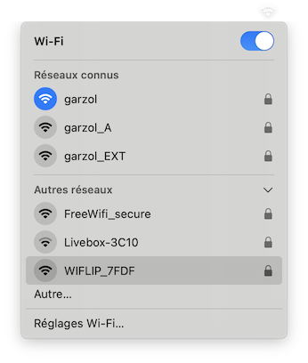
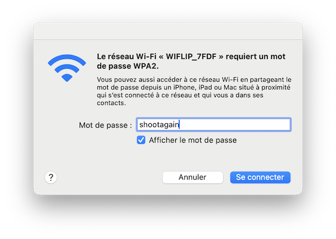
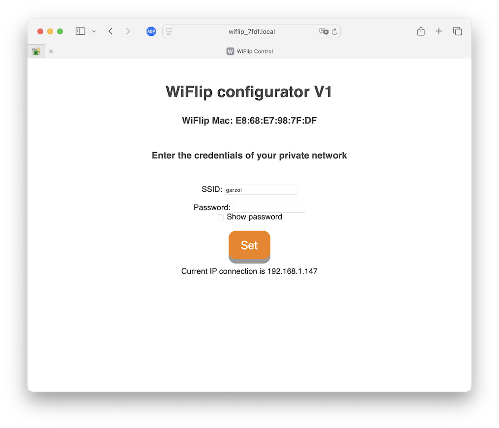
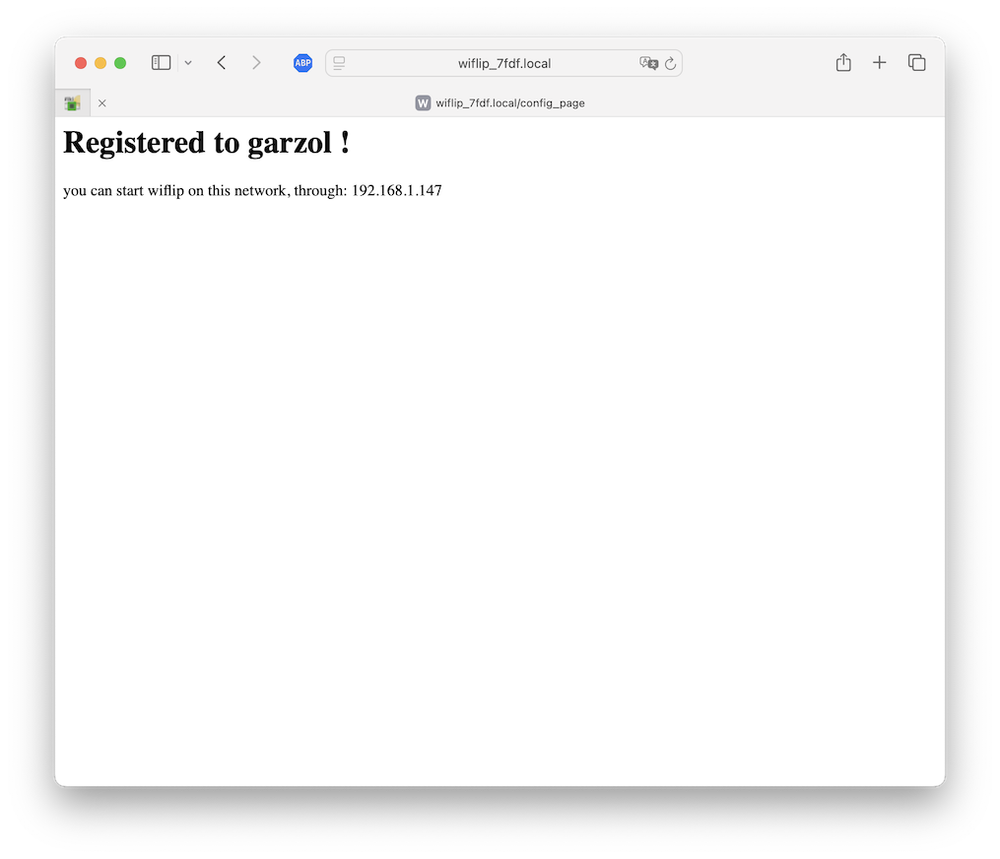
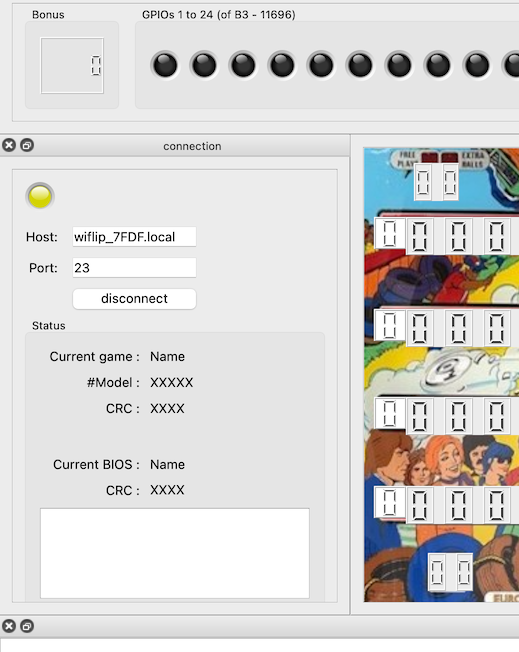

### User doc  

<h2>First connection</h2>

First thing to do is to let Wiflip know about your network in order to connect to it

Turn on the pinball. Then, from a PC, look for a wifi network with a name like WiFlip_XYZT and connect to it.
The wifi password for this network is 
shootagain.
  

Once the connection is established, open your browser (such like Firefox) and in the url field, enter the following address: 
http://192.168.4.22

alternately, you can try to connect to http://WIFLIP_XYZT.local where XYZT are the characters you read
from your device's Acess Point name

You will reach a page asking for your home gateway credentials, namely name and password

Enter these data, validate, and wait for a success message.

If it does not work, this might be that you entered a wrong password or that the network is temporarily unreachable, or off range.

Repeat the operation until it works (success message).

The success page will display the local IP that is given to the WiFlip device. Please, note the indicated value. 
Something like 192.168.1.18

Once it is done, don't forget to reconnect your PC to your usual home gateway. You won't need to connect to the WiFlip_XYZT any more, unless your DHCP server reattached another IP address to the WiFlip device.

Sometimes, the DHCP server changes the device address it had given previously (after a gateway reboot, 
	for example, or after that many new devices are declared on your local network, or simply after that a timeout has elapsed.

You usually realise that the address has changed, as the connection is suddenly impossible to make. 
	In such a situation, you will need to go to the WiFlip_XYZT again and check the indicated IP given by the DHCP server.

Things become simpler if your local network makes use of the mDNS protocol. This widely used protocol makes possible to use 
	strings for urls instead of cryptic 192.168... You will be able to address urls by name on your local network.

With mDNS installed on your network, you can access wiflip through the name : 
	<strong>wiflip_xyzt.local</strong> (replace xyzt with your own values) 
	 This string is case insensitive. 
	 You just need to type this in 
	the host field, instead of the numeric host name, and click connect. You might have to wait for 1mn on the very first connection.
	In general, the connection is made instantly.

Open the wiflip application from your PC or MAC and type the IP address you noted in the HOST field.

Click on connect. The connection led turns yellow, and becomes green once the connection is established

It does not matter whether you click the connect button first, then power on the pinball, or the opposite. Both are OK.

If you turn the pinball off, then on again, the connection will be lost. The application might not notice it. The backglass replication typically freezes in such a situation. 
	You will have to click disconnect, then connect again to recover the connection.

You can connect up to 4 computers simultaneously to the same wiflip device. Not very useful, but feasible

The best way for determining if you have mDNS or not is to try using wiflip_xyzt.local for the url and see if it works. If it does not, get back to the numerical values. 
	mDNS usually comes with services such as Bonjour

&#x26A0; WiFlip only works on the 2.4GHz band. 

